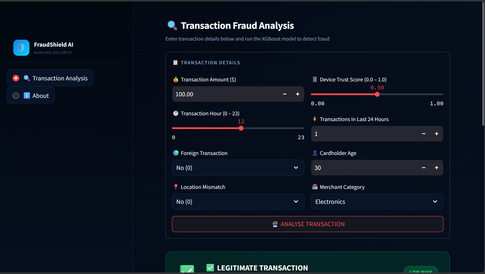

# 🛡️ FraudShield AI: Banking Fraud Detection System

An AI-powered banking fraud detection system built using **XGBoost**, **Scikit-learn**, and **Streamlit**. The application analyzes transaction details and predicts whether a transaction is legitimate or potentially fraudulent.

## 📌 Project Overview

Financial fraud is a growing challenge in digital banking. This project uses machine learning to identify suspicious transactions and assist financial institutions in reducing fraud risks.

The system provides:

* Real-time fraud prediction
* Interactive Streamlit dashboard
* Feature scaling and preprocessing
* XGBoost-based classification model
* User-friendly interface for transaction analysis

---

## 🚀 Features

✅ Fraud Detection using XGBoost

✅ Interactive Streamlit Web Application

✅ Real-Time Transaction Analysis

✅ Feature Scaling with Scikit-Learn

✅ Machine Learning Model Deployment

✅ Clean and Modern User Interface

---

## 🛠️ Tech Stack

| Technology   | Purpose                   |
| ------------ | ------------------------- |
| Python       | Core Programming Language |
| Streamlit    | Web Application Framework |
| XGBoost      | Machine Learning Model    |
| Pandas       | Data Processing           |
| Scikit-Learn | Data Preprocessing        |
| Joblib       | Model Serialization       |

---

## 📂 Project Structure

```text
fraudshield-ai/
│
├── app.py
├── credit_card_fraud.ipynb
├── credit_card_fraud_10k.csv
│
├── models/
│   ├── fraud_detection_xgboost.pkl
│   ├── scaler.pkl
│   └── feature_name.pkl
│
├── screenshots/
│   ├── Dashboard.png
│   └── result.png
│
└── README.md
```

## 📊 Dataset

The project uses a credit card transaction dataset containing both legitimate and fraudulent transactions.

Dataset features are preprocessed and scaled before being used for model training and prediction.

---

## ⚙️ Installation

### Clone Repository

```bash
git clone https://github.com/singhshagun08/fraudshield-ai.git
cd fraudshield-ai
```

### Install Dependencies

```bash
pip install -r requirements.txt
```

### Run Application

```bash
streamlit run app.py
```

---

## 🖼️ Application Screenshots

### Dashboard



### Fraud Detection Result


---

## 🤖 Machine Learning Model

Model Used:

* XGBoost Classifier

Workflow:

1. Data Collection
2. Data Cleaning
3. Feature Scaling
4. Model Training
5. Model Evaluation
6. Deployment using Streamlit

---

## 🎯 Future Enhancements

* Real-time banking API integration
* Advanced anomaly detection
* Transaction history visualization
* Multi-model ensemble approach
* Cloud deployment

---

## 📜 License

This project is licensed under the MIT License.
